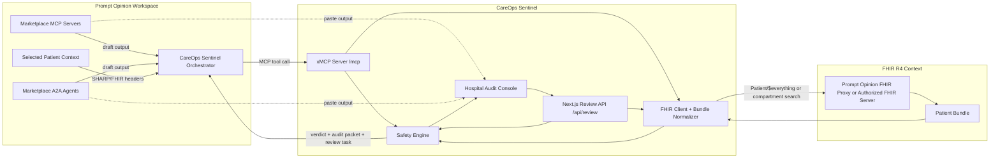
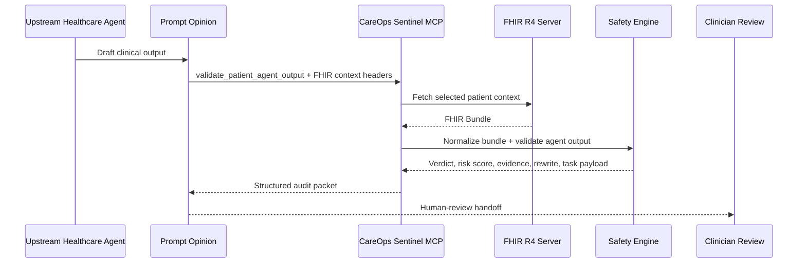
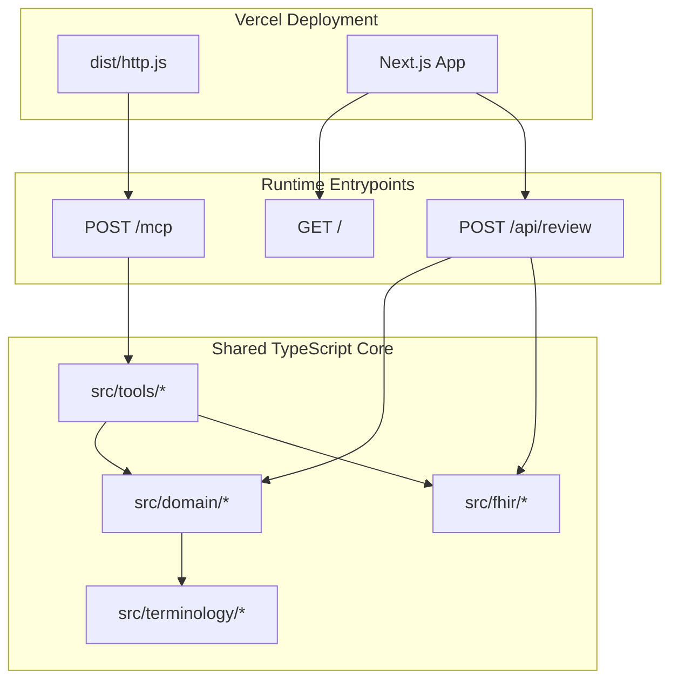
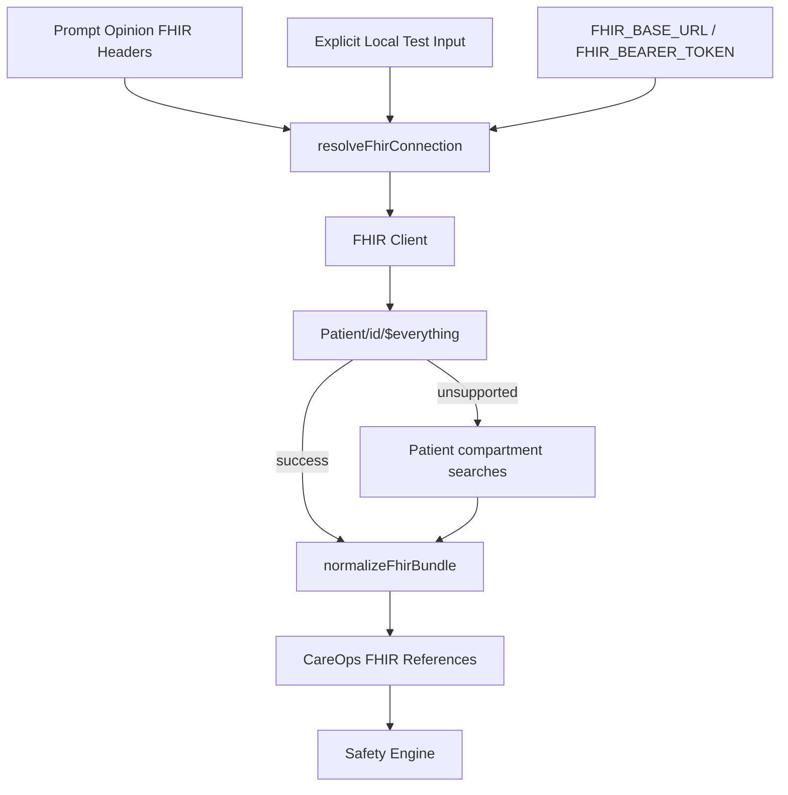
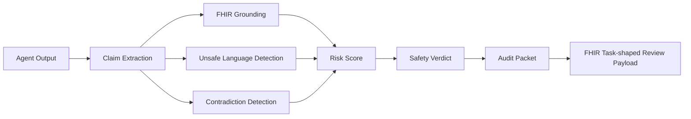

# CareOps Sentinel Architecture

CareOps Sentinel is a safety and governance layer for healthcare agents running inside Prompt Opinion.

The system has two product surfaces:

- an MCP server that Prompt Opinion and agents can invoke;
- a hospital-facing audit console that demonstrates how teams can review outputs from marketplace agents.

Both surfaces use the same safety engine.

## End-To-End System



## Core Product Flow



## Deployment Topology



## Runtime Components

### Prompt Opinion Orchestrator

The orchestrator is configured inside Prompt Opinion as the A2A-facing agent. It receives user requests, can be called by other agents, and delegates safety work to the CareOps Sentinel MCP tools.

Relevant endpoints:

```txt
https://app.promptopinion.ai/api/workspaces/019de1fa-ebc5-7e5e-b6ea-abe36ed0ad33/ai-agents/019e0dd0-f471-7e72-bf83-a476c244ac42/mcp
https://app.promptopinion.ai/api/workspaces/019de1fa-ebc5-7e5e-b6ea-abe36ed0ad33/ai-agents/019e0dd0-f471-7e72-bf83-a476c244ac42/.well-known/agent-card.json
```

### CareOps Sentinel MCP Server

The MCP server is built with `xmcp`. Each tool is a file under `src/tools`.

Primary tool:

```txt
validate_patient_agent_output
```

This tool is the preferred Prompt Opinion path because it receives FHIR context through SHARP-style headers and validates the upstream agent output against the selected patient.

### Hospital Audit Console

The Next.js console is a product demonstration surface. It does not replace Prompt Opinion.

It shows the hospital workflow:

1. choose the upstream marketplace source;
2. paste the output to audit;
3. provide real FHIR context;
4. run a Sentinel audit;
5. inspect evidence, unsafe language, safe rewrite, and review task payload.

The console intentionally fails closed when FHIR context is missing or invalid.

### Safety Engine

The safety engine is deterministic TypeScript under `src/domain`.

Responsibilities:

- split and evaluate agent claims;
- ground claims against normalized FHIR references;
- detect unsafe clinical-action language;
- detect contradictions between agent outputs;
- detect contradictions against patient context;
- generate missing-evidence checklists;
- produce a safe rewrite;
- produce a human-review recommendation;
- produce a FHIR Task-shaped review payload.

## FHIR Context Flow



Header precedence:

1. Prompt Opinion FHIR headers
2. explicit tool/API input
3. environment variables for local controlled testing

There is no hidden production FHIR fallback.

## Validation Model



Verdicts:

- `pass_with_review`
- `needs_revision`
- `blocked`

The system is conservative by design. Unsupported direct clinical action should be blocked or sent to clinician review.

## MCP Tool Surface

| Tool | Purpose |
| --- | --- |
| `validate_patient_agent_output` | Fetch selected patient FHIR context and audit an upstream output |
| `validate_agent_output` | Audit an output against supplied FHIR context |
| `fetch_patient_context` | Fetch and normalize selected patient context |
| `validate_fhir_bundle` | Validate a supplied FHIR Bundle shape |
| `check_fhir_grounding` | Check claims against FHIR references |
| `check_context_contradictions` | Detect contradictions against patient context |
| `detect_agent_contradictions` | Detect contradictions between agents |
| `rewrite_unsafe_language` | Rewrite unsafe action language into review-safe wording |
| `generate_audit_packet` | Create structured audit output |
| `create_review_task_payload` | Create FHIR Task-shaped human-review payload |
| `explain_evidence_match` | Explain why a claim matched or failed to match evidence |
| `resolve_medication_term` | Resolve medication synonyms for matching |
| `resolve_observation_term` | Resolve observation synonyms for matching |
| `list_demo_patients` | Controlled patient listing for sandbox testing only |

## Data Boundary

CareOps Sentinel is built for synthetic or de-identified FHIR R4 data in this hackathon.

The server should not store PHI. FHIR data is fetched for the active request, normalized into evidence references, and used to produce an audit packet.

## Safety Boundary

Allowed outputs:

- clinician-review recommendation
- missing-evidence finding
- FHIR grounding explanation
- contradiction finding
- safe rewrite
- review task payload

Disallowed outputs:

- diagnosis
- medication order
- treatment approval
- automatic prior-auth submission
- any instruction that bypasses clinician review

## Why This Architecture Fits The Hackathon

The hackathon is about MCP, A2A, and FHIR interoperability.

CareOps Sentinel uses all three:

- MCP exposes reusable safety tools;
- A2A lets the orchestrator be called by other agents;
- FHIR context grounds the audit in selected patient data.

The product thesis is simple:

> As the healthcare-agent marketplace grows, hospitals need an agent that audits agents.
